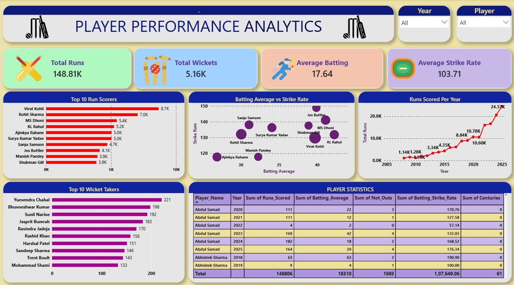
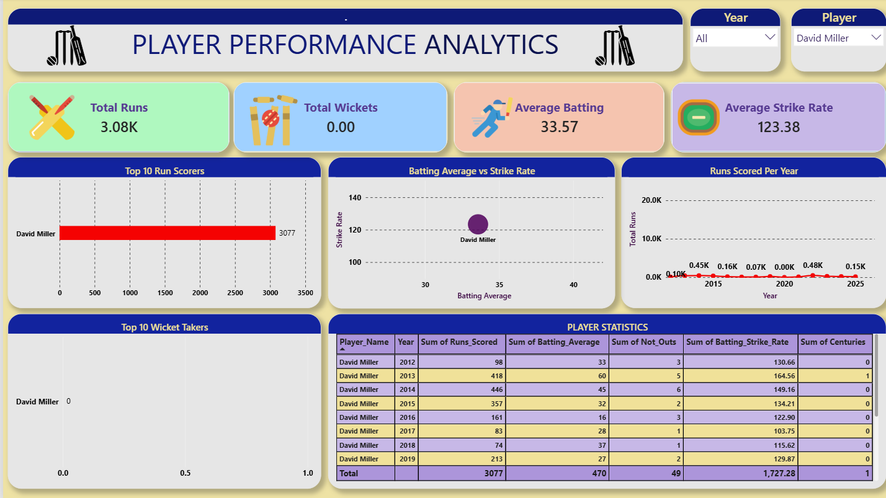
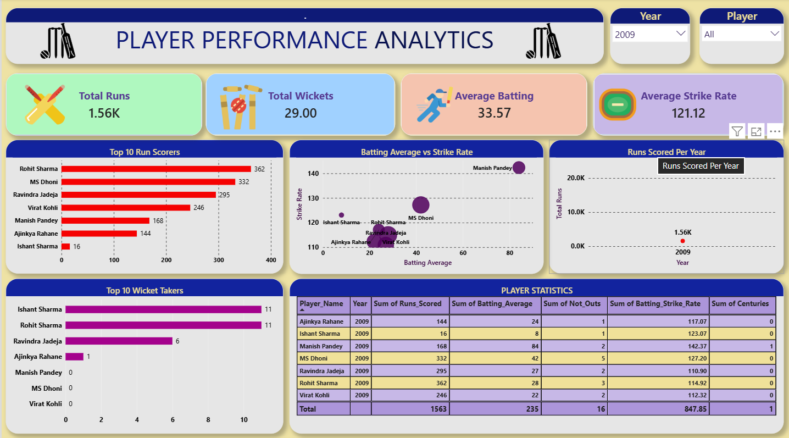

\# 🏏 Player Performance Dashboard


An interactive **Power BI dashboard** for analyzing cricket player performance across batting, bowling, and yearly trends.


\## 📊 Project Overview


The **Player Performance Dashboard** transforms cricket statistics into an interactive Power BI report that allows users to analyze player performance, compare batting and bowling statistics, identify top performers, and track yearly trends.


The dashboard provides interactive filtering by \*\*player and year\*\* to make performance comparison easier.


\## 🎯 Project Objectives


\- Analyze cricket player statistics

\- Compare batting and bowling performance

\- Identify top-performing players

\- Analyze yearly performance trends

\- Enable interactive player and year comparisons

\- Present cricket statistics through meaningful visualizations


\## 📁 Dataset


The project uses a CSV dataset containing cricket player statistics.


| Attribute | Details |
|-----------|---------|
| File | `cricket_data_2026.csv` |
| Records | 1,096 |
| Columns | 25 |
| Format | CSV |
| Data Preparation | Power Query |

\### Key Fields


\- Player Name

\- Year

\- Runs Scored

\- Wickets Taken

\- Batting Average

\- Batting Strike Rate

\- Bowling Average

\- Economy Rate

\- Highest Score

\- 100s

\- 50s

\- Not Outs


\## 🛠️ Tools \& Technologies


\- Power BI — Dashboard development and visualization

\- Power Query — Data cleaning and transformation

\- DAX — Calculated measures and KPIs

\- CSV — Source dataset


\## 📈 Dashboard Features


\### KPI Cards


The dashboard includes key performance indicators such as:


\- Total Runs

\- Total Wickets

\- Average Batting

\- Average Strike Rate


\### Visualizations


The dashboard contains:


\- **Top Run Scorer** — Ranking players based on total runs

\- **Top Wicket Takers** — Comparing players based on wickets

\- **Batting** **Average vs. Strike Rate** — Scatter plot for player comparison

\- **Runs by Year** — Yearly trend analysis

\- **Player Filter** — Analyze individual player performance

\- **Year Filter** — Analyze performance across different years


\## 🧮 DAX Measures


\### Total Runs


```DAX

Total Runs =

SUM(cricket\_data\_2026\[Runs\_Scored])


Total Wickets =

SUM(cricket\_data\_2026\[Wickets\_Taken])


Avg. Batting =

AVERAGE(cricket\_data\_2026\[Batting\_Average])


Avg. Strike Rate =

AVERAGE(cricket\_data\_2026\[Batting\_Strike\_Rate])


```

🧹 Data Cleaning \& Transformation


Power Query was used to prepare the cricket dataset for analysis.


The main data preparation tasks included:


\- Cleaning inconsistent data

\- Handling Missing Values

\- Converting text values to numeric values

\- Preparing data for analysis and visualization


🔍 Key Insights


* Virat Kohli was identified as the top run scorer.
* Yuzvendra Chahal was identified as the leading wicket taker.
* Runs vary across seasons, with visible yearly peaks.
* Interactive filters allow quick comparisons between players and years.


## 📸 Dashboard Preview

### Dashboard



### Player Filter



### Year Filter




